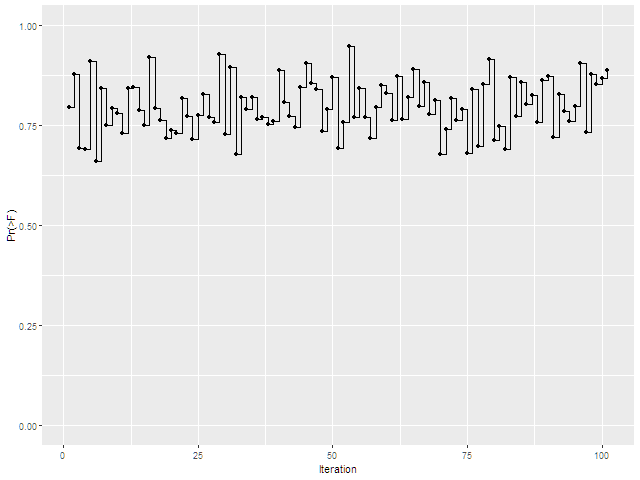
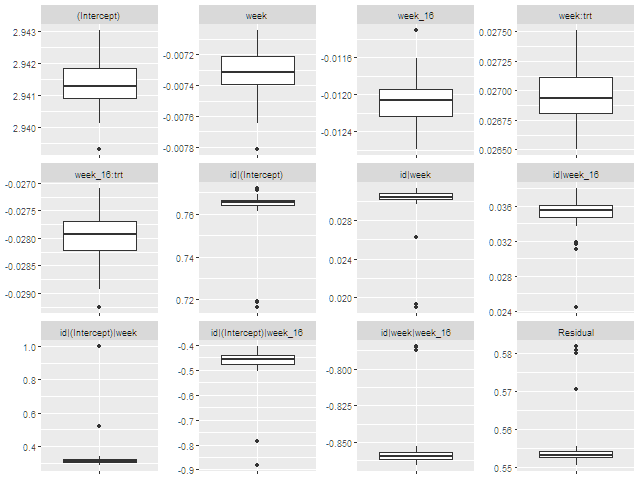
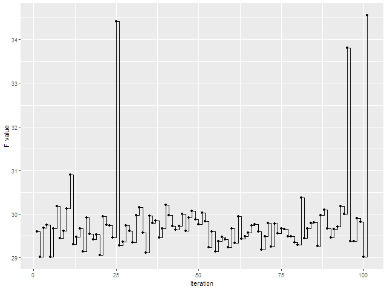

```{r setup, include = FALSE}

knitr::opts_chunk$set(
  collapse = TRUE,
  comment = "#>"
)
library(simstudy)
library(arsenal)
library(perturb)
library(huxtable)
options(seed=3799592)
```

The `perturb` function is used to evaluate model robustness by adding random noise to selected model parameters. The model is re-estimated e.g. 100 times, after which the stability of coefficients can be evaluated. Any derived terms, transformations, interactions, are re-evaluated at each iteration. This approach can be used with (generalised) linear regression models, multinomial logistic regression, and mixed models estimated with `nlme::lme` or `lme4::lmer`.

## Example:

The following example estimates a linear regression model. 

```{r, echo=TRUE}
library(car)
data(Duncan)

m1<-lm(prestige~income+education,data=Duncan)
summary(m1)
```

The VIF statistics for this model are quite low, there's no real concern for collinearity.

```{r, echo=TRUE}
vif(m1)
```

The model stablity can be evaluated by re-estimating the model 100 times. At each iteration, a random number from a normal distribution with a mean of 0 and a standard deviation of 1 is added to variables `income` and `education`.

```{r, echo=TRUE}
library(perturb)
p1<-perturb(m1,pvars=c("income","education"),prange=c(1,1))
summary(p1)
```

## Post-run commands (e.g. linear tests)

The `perturb` allows a command to run after each iteration. In some cases, there can be an interest in a linear combination of model coefficients. In that case, it makes sense to run a linear test after each iteration and to evaluate how the test results behave during the iterations. The following example is somewhat contrived but illustrates how `postrun` could be used:


```{r, echo=TRUE}
p2 <- perturb(m1,pvars=c("income","education"),prange=c(1,1),postrun="linearHypothesis(m1, \"income = education\")")
```
After the model is run, the results can be extracted.

```{r, echo=TRUE}
# Extract the postrun values
prun <- p2$postrun
prun$call
```

The results will need to be transformed into a dataframe rather than a list of dataframes and the `call` will no longer be needed.

```{r, echo=TRUE}
# Remove the call
prun$call <- NULL
# Create a data frame with postrun results
prun <- do.call("rbind",prun)
```

In the case of `car::linearHypothesis`, each run produces a data frame with two records, for the original model and for the linear hypothesis. The first of these records should be removed.

```{r, echo=TRUE}
head(prun)
# Remove empty rows for the original model
prun <- prun[!is.na(prun$Df),]
```

One possibility at this point is to create a plot of p-values throughout the iterations. For this example, there are no big surprises ...

```{r}
prun$iter <- seq.int(nrow(prun))
library(ggplot2)
plot1 <- ggplot(data=prun,aes(x=iter,y=prun[,6],group=1))
plot1 <- plot1+geom_step()+geom_point()
plot1 <- plot1+scale_x_continuous(name="Iteration")
plot1 <- plot1+scale_y_continuous(name=colnames(prun)[6],limits=c(0,1))
```
```{r,echo=FALSE,results='hide'}
png(file="plot1.png",width=640)   
plot1
dev.off()
```
```{r,echo=FALSE}
library(knitr)
 
```

## Mixed Models

The `perturb` function can also be used with `lme4::lmer` and `nlme::lme` for mixed models.
The following example is taken from chapter 8 of “Applied Longitudinal Analysis” by	Fitzmaurice, Laird, and Ware (2004). This is an interesting example because 

- The data are publicly available 
-	The model contains a random slope variable that is a transformation of another variable in the model
-	The lmer output reports “Model is nearly unidentifiable: very large eigenvalue  - Rescale variables?”. (Interestingly, PROC MIXED in SAS does not report any issues).

If the model is nearly unidentifiable, then how might the results be affected if there were minor changes to the data?

The `cd4` dataset is from the “ACTG Study 193A”.  This was a randomised, double-blind study of 1309 AIDS patients where subjects with dual combinations of HIV-1 inhibitors are compared to subjects with triple combinations. The dependent variable is `logcd4`, calculated as the log of the CD4 counts plus 1. The CD4 counts were assessed at baseline and between 1 and 9 times during the 40 weeks follow-up. The timing of assessments relative to baseline is measured in weeks.

On page 226 of “Applied Longitudinal Analysis”, lowess smoothed curves of logcd4 indicate a peak at 16 weeks. Based on this, the example in that book fits a piecewise linear spline model with a knot at week 16. 

`m1<-lmer(logcd4 ~ week+week_16+trt:week+trt:week_16 + (1+week+week_16 | id),data=cd4)`

Variable `week_16` is calculated as the maximum of 0 or week – 16. Variable `trt` is 1 for subjects with triple therapy (group = 4 in the data) and 0 otherwise. Variable `id` is the subject identifier.


```{r}
library(lme4)
data("cd4")
m1<-lmer(logcd4 ~ week+week_16+trt:week+trt:week_16 + (1+week+week_16 | id),data=cd4)
(m1summary<-summary(m1))
```
```{r}
library(huxtable)
fixed_tbl <- as_hux(m1summary$coefficients,add_colnames = TRUE,add_rownames = TRUE)
number_format(fixed_tbl)[,2:4] <- 3
align(fixed_tbl)[,2:4] <- "."
caption(fixed_tbl) <- "Fixed effects of model for ACTG study 193A"
fixed_tbl[1,1]$rownames <- ""
theme_article(fixed_tbl)
```

The fixed effects estimates and their S.E.’s match those on page 227 of “Applied Longitudinal Analysis” to 3 decimal places (t-values match with the Z-values to 2 decimal places). The negative effect of `week` indicates that CD4 counts decreased during the first 16 weeks for the reference `trt` group (dual therapy). The positive value of `week + week:trt` indicates an increase of CD4 counts in the first 16 weeks. After week 16, CD4 counts decline somewhat more quickly for subjects with dual therapy and decline at almost the same rate for subjects with triple therapy.

```{r}
ran <- as.data.frame(VarCorr(m1))
colnames(ran) <- c("Group", "Variable", "With:", "Variance\nCovariance","S.D.\nCorrelation")
ran_tbl <- as_hux(ran,add_colnames = TRUE)
number_format(ran_tbl)[,4:5] <- 3
align(ran_tbl)[,1] <- "right"
caption(ran_tbl) <- "Random effects of model for ACTG study 193A"
theme_article(ran_tbl)
```
The model has a random intercept at the subject level and random slopes for both `week` and `week_16`, with an unconstrained covariance structure. The variances/covariances correspond with the values on page 228. The correlations show a strong negative value of -0.858 between the random slopes for `week` and `week_16`.

To test the stability of the results, the model was re-estimated 100 times, adding a random number from normal distribution with mean 0 and SD 3 to variable week at each iteration. The variable week_16 was derived from week at each iteration prior to re-estimating the model. At each iteration, the random and fixed effects of the model were stored, then presented at the end of the procedure using summary statistics.


On page 227, the example discusses a linear test that the fixed effects of `week` by `trt` and of `week_16` by `trt` are both zero. This can be replicated in R as follows:

```{r}
L <- rbind(c(0,0,0,1,0),c(0,0,0,0,1))
(Page227 <- lmerTest::contest(m1,L))
```

“Applied Longitudinal Analysis” reports a Wald test statistic of 59.21, which corresponds with 2 (the numerator df) times the F value reported above.

## Perturbance Analysis

To test the stability of the results, the model was re-estimated 100 times, adding a random number from normal distribution with mean of 0 and an SD of 0.5 to variable week at each iteration. An SD of 0.5 will result in 95.4% of the perturbations being between -1 and 1 week. The variable week_16 was derived from week at each iteration prior to re-estimating the model. At each iteration, the random and fixed effects of the model were stored, then presented at the end of the procedure using summary statistics.

```{r, warning=FALSE}
# Make the results reproducable
set.seed(803790744)

q<-perturb(m1,pvars=c("week"),prange=c(0.5),ptrans="week_16<-pmax(week-16,0)",postrun="lmerTest::contest(m1,L)")
(q_sum<-summary(q))
saveRDS(q, file = "SD0_5.rds")
```
```{r}
q <-readRDS(file = "SD0_5.rds")
q_sum<-summary(q)
q_tbl <- as_hux(q_sum$summ,add_colnames = TRUE,add_rownames = TRUE)
number_format(q_tbl)[,2:5] <- 3
align(q_tbl)[,1] <- "right"
align(q_tbl)[,2:5] <- "."
q_tbl[1,1]$rownames <- ""
caption(q_tbl) <- "Summary statistics of model coefficients after 100 perturbations (SD = 0.5)"
theme_article(q_tbl)
```
This table shows the results of the perturbation analysis. The SD of the coefficients over the iterations shows which coefficients were most affected by the perturbations. This is the case for the correlations of the intercept with variables `week` and `week_16`. The correlations between the intercept and week had an SD of 0.097 over the iterations and ranged from 0.292 to 1.000. The correlation between the intercept and `week_16` also has a moderately high SD of 0.063 and ranges from -0.842 to -0.422. The fixed effects, on which the substantive conclusions are based, remain quite stable.

The descriptive statistics of coefficients over the iterations can also be represented by a set of box-plots. In these boxplots, the lower and upper hinges correspond with the first and third quartiles. The upper whisker extends from the hinge to the highest value under 1.5 * IQR (Inter-Quartile Range), the lower whisker extends to the lowest value under 1.5 * IQR. Values outside the upper and lower whiskers can be considered outliers.

```{r}
# Get the data from the perturb object
df<-as.data.frame(q$coeff.table)
# Reshape to a long structure with variables "key" and "value"
df2<-tidyr::gather(df,factor_key=TRUE)
# Create the figure
lmer_fig1 <- ggplot(data=df2,aes(factor(key),value))+geom_boxplot()+
  facet_wrap(vars(key),ncol=4,scales="free")+
  theme(axis.text.x=element_blank(),axis.title.x=element_blank(),axis.title.y = element_blank())
```
```{r,echo=FALSE,results='hide'}
png(file="lmer_fig1.png",width=640)   
lmer_fig1
dev.off()
```
```{r,echo=FALSE}
 
```


The boxplot for the correlation between the random intercept and the random slope for week is quite interesting. There is an outlier for the value 1, followed by a gap down to under 0.5. An examination of the perturbed parameters shows 2 values of exactly 1. 

```{r}
b <- which(q$coeff.table[,"id|(Intercept)|week"] > 0.999)
length(b)
```

If these values are excluded, the maximum correlation between the intercept and week is 0.45. 

```{r}
options(digits=3)
summary(q$coeff.table[-b,"id|(Intercept)|week"])
```

```{r}
# Extract the postrun values
prun <- q$postrun
prun$call <- NULL
prun <- do.call("rbind",prun)
prun$iter <- seq.int(nrow(prun))
conplot <- ggplot(data=prun,aes(x=iter,y=prun[,5],group=1))
conplot <- conplot + geom_step()+geom_point()
conplot <- conplot + scale_x_continuous(name="Iteration")
conplot <- conplot + scale_y_continuous(name=colnames(prun)[5])
```
```
```{r,echo=FALSE,results='hide'}
png(file="conplot.png",width=640)   
conplot
dev.off()
```
```{r,echo=FALSE}
 
```


The conclusion must be that this model is indeed unstable, in the sense that changes to the data could lead to convergence problems. What is very interesting is that the fixed effects remain stable, despite the fact that random effects show strong shifts or perfect correlations among random effects.
